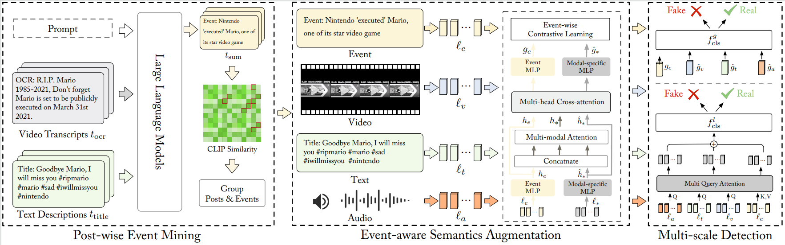

## EAM: Event-Aware Multimodal Representation Learning for Short Video Fake News Detection

---

## Introduction

The Event-Aware Multimodal (**EAM**) representation learning method that directly learns event semantics from raw multimodal posts, and jointly models both holistic and detailed cues for detection.




## Dataset
We conduct experiments on two datasets: [FakeSV](https://github.com/ICTMCG/FakeSV) and [FakeTT](https://github.com/ICTMCG/FakingRecipe/blob/main). 

- **Data Format**:
  ```
    {
        {"video_id": "7332393503843962144", 
         "description": "UFO recorded in Romania #ufo #ufos #uaps #ovni #onvis #alien #aliens #ufosighting #extraterrestrial #ufocommunity #uap #uaptiktok #viral #fyp ", 
         "annotation": "fake", 
         "ocr": "FO recorded in Romania What do you think of this let me know in comments", 
         "model_response": "UFO spotted in Romania"}
    }
  ```
##  Environment
conda 4.5.11,Python 3.9.12,pytorch 2.4.1+cu121.For other libs,please refer to the file requirements.txt.