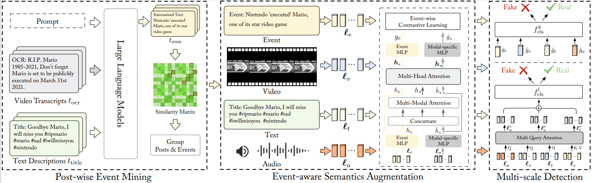

## EAM: Event-Aware Multimodal Representation Learning for Short Video Fake News Detection

---

## Introduction

The Event-Aware Multimodal (**EAM**) representation learning method that directly learns event semantics from raw multimodal posts, and jointly models both holistic and detailed cues for detection.




## Dataset
We conduct experiments on two datasets: [FakeSV](https://github.com/ICTMCG/FakeSV) and [FakeTT](https://github.com/ICTMCG/FakingRecipe/blob/main). 

- **Processed Data**:
  - [FakeSV Processed Data](./data/dataset/fake_sv_processed.json)
  - [FakeTT Processed Data](./data/dataset/fake_tt_processed.json)

- **Data Format**:
  ```
    {
       "video_id": "7332393503843962144",   #short video news id
       "annotation": "fake",                #short video news label(real/fake)
       "event": "UFO spotted in Romania",   #short video news events are summarized by LLM
       "text_description": "UFO recorded in Romania #ufo #ufos #uaps #ovni #onvis #alien #aliens #ufosighting #extraterrestrial #ufocommunity #uap #uaptiktok #viral #fyp ", #short video news title
       "video_transcripts": "FO recorded in Romania What do you think of this let me know in comments",  #short video news transcripts
    }
  ```
##  Environment
conda 4.5.11,Python 3.9.12,pytorch 2.4.1+cu121.For other libs,please refer to the file requirements.txt.